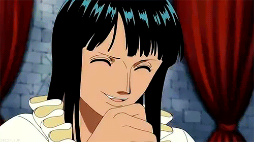

# 🌟 Portfólio

Oiee, bem-vindo(a) ao meu cantinho. Este projeto é meu portfólio pessoal
onde compartilho um pouco sobre minha jornada como desenvolvedora, meus projetos
e paixões. Foi desenvolvido com _**Vue 3**_ , _**TypeScript**_ e _**Vite**_, este site reflete não só
minhas habilidades técnicas, mas também um pouco da minha personalidade com seus _easter eggs_.

Quando não estou codando, você provavelmente me encontrará falando de One Piece
(sim, já estou em dia com o anime), explorando o universo geek ou mergulhando
em alguma nova tecnologia. A cultura geek é parte fundamental de quem eu sou, e
isso se reflete na forma como abordo desafios e crio algumas soluções.

<br>
<p align="center">
  
</p>
<br> 


## 🚀 Executando o Projeto

### 📋 Pré-requisitos

- ✅Bun (versão v1.3.1 recomendada)

### 💻 Instalação

```bash
# Instalar dependências
bun install

```

### 📜 Scripts Disponíveis

```bash
# Iniciar servidor de desenvolvimento
bun run dev

# Compilar para produção
bun run build


```

